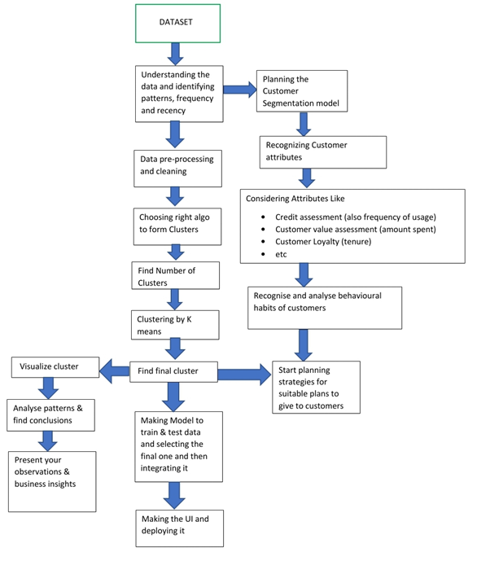
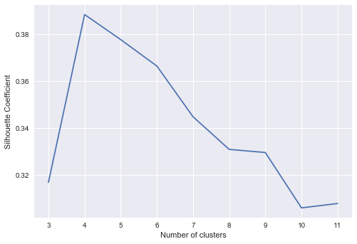
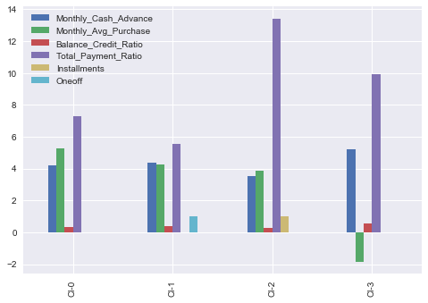

# Credit-Card-Customer-Segmentation

## Problem Statement
RBL’s marketing department collects various customer specific data of the credit card holders. They need a mechanism to segment the customer based on underlying characteristics and form market clusters which will be easy for them to target and provide product ideas to the management. Currently these tasks are performed manually by trusting the judgment of experts in the field. These can lead to human error, biased decision and other factors which may not be helpful to create a customer cluster that actually exist. They want to design a system that would automate this process and help the different stakeholders to make informed business decision.

## Objective
- To develop a solution focused on developing a clustering algorithm based on unsupervised learning. 
- Try various clustering algorithm, and identify the best model for the business scenario and build and fine tune them based on characteristics. 
- Deploy the machine learning model using Flask API and pickle files. 
- Design a UI for entering model inputs and display results accordingly.-

## Flow diagram of the project

## Project Summary
* Derived new KPI by using data manipulation methods.
* Checked the multi-collinearity using heatmap.
* Standardized the data and applyied PCA to get optimal number of Pricipal Components.
* KMeans Clustering is used - Silhotte Score and Cluster Inertia Score used to fix the number of clusters.
* Done profiling to draw insights for the clusters.

## Final Clusters and Recommendations
* Based on silhouette_score, i have taken number of clusters to be 4.

* **Suggested Marketing Strategy for these clusters:**
* Group 0
   - This is performing best among all the clusters are maintaining highest monthly average purchases. Giving any reward points might increase their purchases.
* Group 1
   - This group is doing maximum oneoff payments(may be for bills only). Customers of this group can be offered discount/offer on next transactions upon full payment.  
* Group 2 
   - They are potential target customers who are paying bills and doing purchases and maintaining comparatively good credit score. So we can increase credit limit or can lower down interest rate. Promote premium cards/loyality cars to increase transcations.  
* Group 3
   - These customers are taking maximum cash advance, these customers should be given remainders for payments. Offers can be provided on early payments to improve their payment rate.

